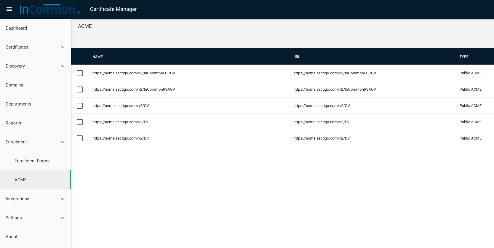
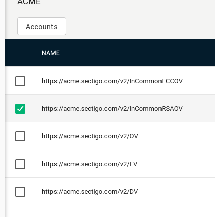
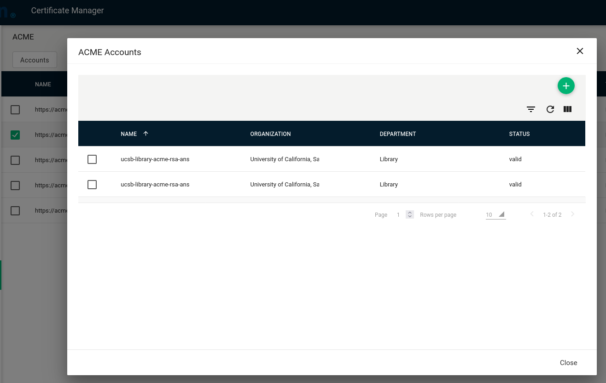
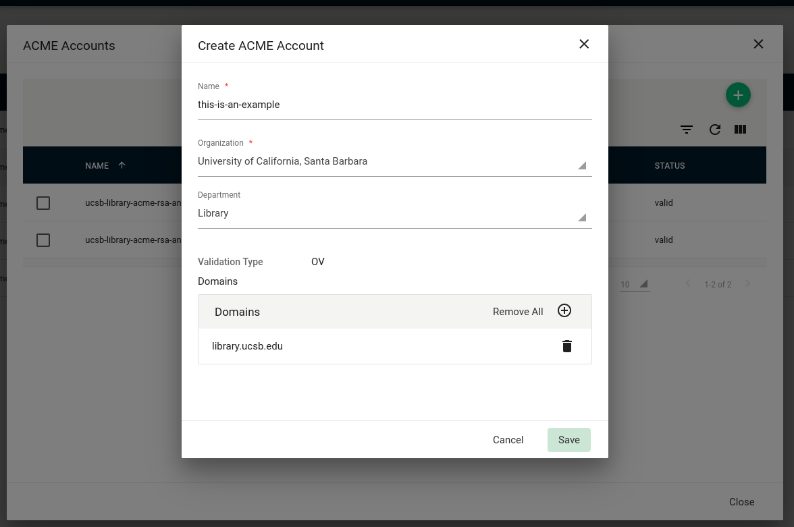
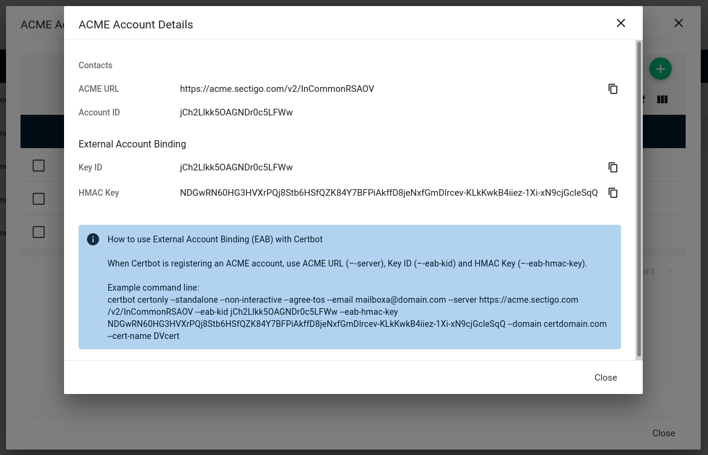
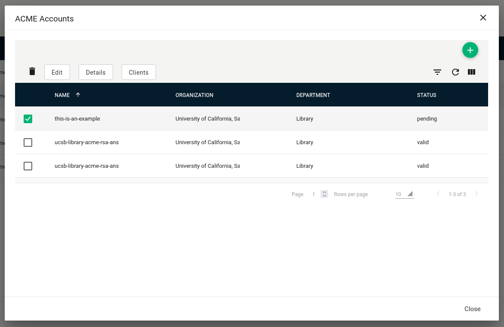

# Sectigo

Select Enrollment
=======================

After logging into the Sectigo Certificate Management portal, select **Enrollment** -> **ACME** from the left panel.

Select ACME Endpoint
=======================

Select an ACME endpoint that corresponds to the type of certificate you wish to generate.  Generally this will be either the **InCommonRSAOV** or **InCommonECCOV**.  Later you will supply this url for certificate registration.

Select Accounts Button
=======================

After selecting the desired endpoint, click the **Accounts** button.

Create ACME Account
=======================

Create a new ACME account.  Click SAVE.

ACME Account Creation Results
=======================

Here you are presented with a new **Key ID** and **HMAC Key**.  These are important, and should probably be stored safely away in your password manager.  

Account Pending
=======================

After closing the Account Creation Results, you will notice that your new account is listed as _Pending_.
